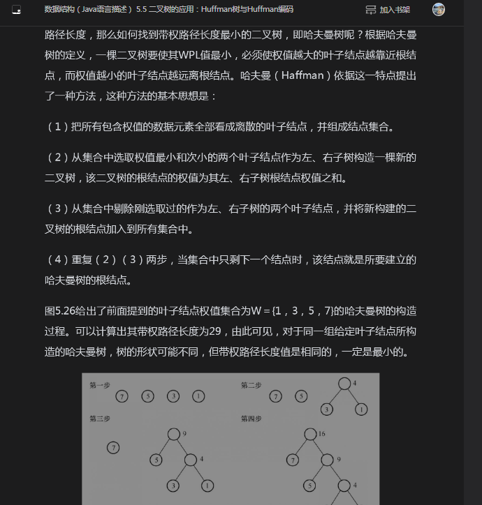

# 树

## 二叉树

比起线性数据结构，二叉树的好处就是数据查找时能将O(N)的时间复杂度降为O(logN)

度、层、完全二叉树、满二叉树...

满二叉树是完全二叉树的特例，叶子节点也挂满的完全二叉树就是满二叉树。

完全二叉树是指除了最深的一层外，其余层都挂满且最深的一层子节点从左到右紧凑排列


```java
// 只有孩子
class Node {
 int val;
 Node left;
 Node right;
}

// 双亲表示
class Node {
 int val;
 Node left;
 Node right;
 Node parent;
}

```

## 常见种类

- 满二叉树
非叶子节点的度（节点拥有的子树数目）都为2且叶子节点是挂满的
- 完全二叉树
除叶子节点外，其余都和满二叉树一样，但叶子节点从左到右紧凑排列
- 二叉搜索树
手写最常见的，左节点值小于双亲节点值且小于右子节点值，所以特殊情况下会变成链表
- 哈夫曼树（最优二叉树）
加权路径长度最小的情况，仅叶子节点有权重，且从根节点到每个叶子节点的路径长度*叶子节点权重，然后求和，这个和最小的树。

- 平衡二叉树
由于二叉搜索树在特殊情况下，会转变为链表，所以需要平衡他的左右子树高度差
  - AVL树
  左右子树的高度差绝对不大于1，如果大于1，就得进行节点旋转。所以删除时可能非常耗时。
  - 红黑树
  控制了旋转次数，降低了平衡的要求。RB-tree属于一种折中选择。特性如下：
    - 每个节点都被定义为红色或者黑色
    - 根节点是黑色
    - 每个叶子节点是黑色
    - 如果一个节点是红色的，那他子节点必须是黑色。红色节点父节点和子节点都不能是红色，所以路径上不会出现连续的红色节点
    - 任意一节点到每个叶子节点路径包含的黑节点数量都相同。其实从这些特性里就能看出来，无论是AVL还是红黑树，手写实现起来其实都还是蛮复杂的。


## 遍历

NLR 前序
LNR 中序
LRN 后序

